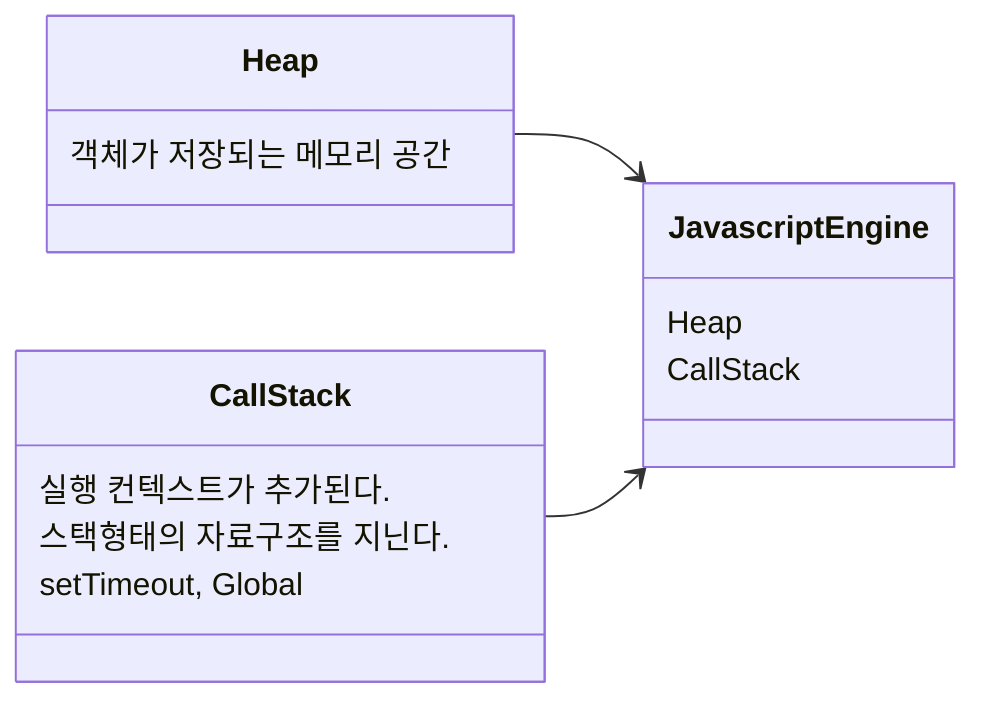
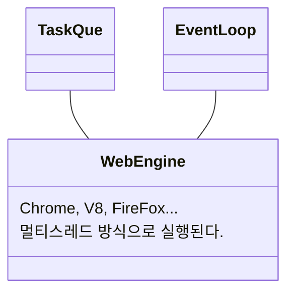

## EventLoop & Task Que

이 두가지를 다루는 이유는 자바스크립트의 작동 방식에 대해서 다루기 위해서이다. TaskQue의 경우 자바스크립트는 싱글 스레드 방식의 동작을 보여준다. 이러한 작업들은 TaskQue에 스택의 형식으로 쌓이게 되면서 실행이 된다. 즉, Task Que는 작업이 실행되기 이전에 대기 장소이다. EventLoop는 자바스크립트가 듀얼 스레드로 여러개의 작업을 실행할 수 있게끔 보여줄 수 있도록 만드는 동작 방식이다. 자바스크립트 엔진 V8, Webkit, SpiderMonkey와 같은 자바스크립트 엔진이 Heap과 CallStack을 이용하여 원활하게 실행이 될 수 있게끔 도와주는 것이 EventLoop 이다.

## 싱글 스레드

자바스크립트의 특징 중 하나가 한 번에 하나의 테스크만 처리할 수 있는 싱글 스레드 방식으로 동작한다는 것이다. 하지만 웹을 보면 한 번에 여러가지 테스크를 처리 하는 것처럼 보인다. 이러한 동시성을 지원하는 것이 Event Loop이다.

자바스크립트 엔진은 앞서 설명했듯이 싱글 스레드 방식으로 렌더링된다. 그렇기 때문에 자바스크트 엔진은 요청된 테스크의 순서대로 callStack에 순서대로 푸시하고 Heap에 저장된 객체를 참조하여 순서대로 처리하며 callstack을 비워나간다.

